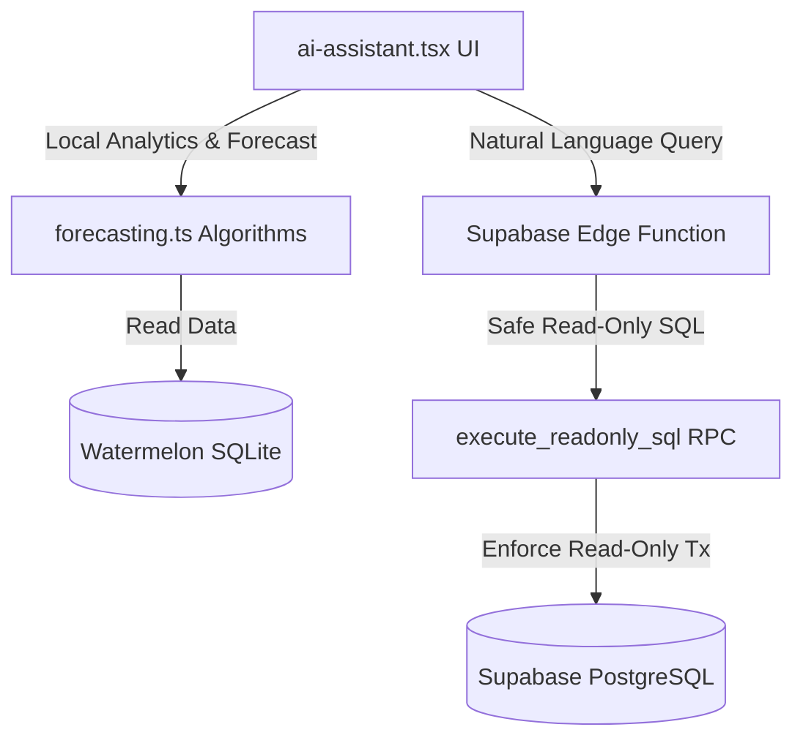

# AI Analytics Skill — InfinityInsight

This skill runbook covers the mathematical modeling, database security sandbox, and interactive UI paradigms developed for **InfinityInsight**, the AI-guided data science and forecasting module in InfinityFinance.

## Architecture Overview

InfinityInsight integrates local time-series statistical modeling (offline-first) with secure remote database NLP-to-SQL querying (online) to offer dynamic financial intelligence:



---

## 1. Local Forecasting Algorithms

To prevent excessive server roundtrips and ensure offline usability, forecasting is processed client-side in [forecasting.ts](file:///d:/GitHub/n3/src/utils/forecasting.ts).

### A. Linear Regression
Calculates a straight-line projection. Useful for simple, monotonic trends.
- **Complexity**: $O(N)$
- **Constraints**: Clamps projected values at 0 (monetary fields cannot be negative).

### B. Double Exponential Smoothing (Holt's Linear Trend)
Applies a level component ($L_t$) and a trend component ($T_t$) to capture directional growth/decay patterns without requiring complete seasonality cycles.
- **Level Formula**: 
  $$L_t = \alpha Y_t + (1 - \alpha)(L_{t-1} + T_{t-1})$$
- **Trend Formula**: 
  $$T_t = \beta(L_t - L_{t-1}) + (1 - \beta)T_{t-1}$$
- **Forecast Formula**: 
  $$\hat{Y}_{t+m} = L_t + m \cdot T_t$$
- **Defaults**: Level smoothing $\alpha = 0.4$, Trend smoothing $\beta = 0.2$.

---

## 2. Secure PostgreSQL SQL Sandbox RPC

Complex SQL-based natural language searches query the remote DB. Security is strictly enforced by forcing PostgreSQL transactions to a read-only state, bypassing any RLS constraints without risking data modification.

### SQL Migration Definition
The procedure is deployed via [20260603000000_add_safe_readonly_sql_rpc.sql](file:///d:/GitHub/n3/supabase/migrations/20260603000000_add_safe_readonly_sql_rpc.sql):

```sql
create or replace function execute_readonly_sql(sql_query text)
returns json
language plpgsql
security definer -- Elevates privileges to bypass RLS safely
as $$
declare
    result_json json;
begin
    -- 1. Force the current transaction block to read-only state
    perform set_config('transaction_read_only', 'on', true);
    
    -- 2. Execute dynamic query safely within the read-only block
    execute 'select json_agg(t) from (' || sql_query || ') t' into result_json;
    
    return coalesce(result_json, '[]'::json);
exception
    when others then
        -- Return structured error text back to client
        return json_build_object('error', SQLERRM);
end;
$$;
```

---

## 3. UI/UX & Visualization Conventions

Interactive outputs are rendered in [ai-assistant.tsx](file:///d:/GitHub/n3/app/(admin)/reports/ai-assistant.tsx):

- **Currency formatting**: PHP is used for all money metrics via `formatPHP` from `src/utils/currency`.
- **Suggestions Bar**: Quick suggestion chips (e.g. "Forecast Portfolio", "Data Critique") allow rapid actions.
- **Dynamic Chart Kit**: Historical and forecasted points are plotted in `LineChart` using `react-native-chart-kit`. Labels are generated dynamically to prevent indexing mismatch crashes.
- **Data Critique Cards**: Discovered anomalies are color-coded:
  - `critical`: Red background (e.g., high-risk PAR, missing critical borrower fields).
  - `warning`: Orange background (e.g., incorrect upfront deductions).
  - `info`: Blue background (e.g., healthy PAR ratios).

---

## 4. Verification Guide

To maintain and test this module, run the following procedures:

### Mathematical Validation (Jest)
Validate math regressions and Holt's algorithms in [forecasting.test.ts](file:///d:/GitHub/n3/src/utils/__tests__/forecasting.test.ts):
```bash
npx jest src/utils/__tests__/forecasting.test.ts
```

### Static Analysis (ESLint)
Ensure there are no styling violations or missing prop structures:
```bash
npm run lint
```
